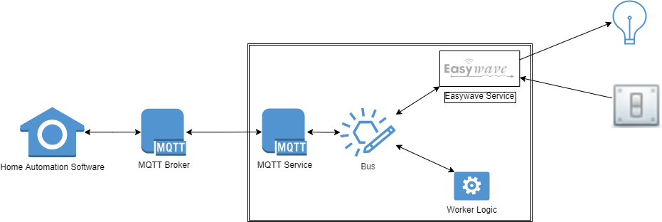

# Easywave2MQTT: Easywave support for [Home Assistant](https://www.home-assistant.io/).

I started this project because I have [Niko](https://www.niko.eu/) Easywave devices in my house, but wanted to automate them with [Home Assistant](https://www.home-assistant.io/).  [Home Assistant](https://www.home-assistant.io/) has no built-in support for Easywave, but is very extensible and easy to interface with via its [MQTT Integration](https://www.home-assistant.io/integrations/mqtt/).

I chose for this approach over a native integration because you have to write those in Python and I am more a C# guy :smiley:. Since .NET 5 you can program in C# for Linux, which means also for [Home Assistant OS on Raspberry PI](https://www.home-assistant.io/installation/raspberrypi).

**This project is a work-in-progress that I work on in my free time.**  The current version is usable, but requires some manual work to get it to work.  Check the [Installing as Home Assistant Add-On](#installing-as-home-assistant-add-on) section for more information.

## What is Easywave?

Easywave is a proprietary wireless protocol developed by [Niko](https://www.niko.eu/) & [Eldat](https://www.eldat.de/), using the robust RF 868 Mhz technology that enables indoor wireless communication up to 30m.  Easywave is a very simple protocol that allows unidirectional (one way) communication between a transmitter and one or more receivers.

Very little technical information can be found on the protocol itself, but what I have detected thus far is that an Easywave message that is sent by a transmitter has 2 parts:

- the transmitters address (unique 6-byte code).
- a single byte payload, indicating what button was pressed.

It is the receiver that decides what messages it processes.  Most of the time this decision process is done by pressing a link button on the receiver and triggering the transmitter to send the message. For example, the
[Niko Single-Pole RF Receiver](https://www.niko.eu/en/products/switching-material-and-socket-outlets/wireless-solutions/one-channel-flush-mounting-wireless-receiver-single-pole-potential-free-productmodel-niko-3f9e1469-93a4-5b9e-94aa-da26caa6a03a)
can be linked in 1- or 2-key mode:

- In 1-key mode, the receiver toggles its state when it receives a fixed button press message from the linked transmitter.
  Example:
  - 123456,A ==> ON
  - 123456,A ==> OFF
  - 123456,A ==> ON
- In 2-key mode, the receiver switches on when it receives the press message for the button that was pressed during linkin, and it switches off when it receives a press message for the next button.
  Example:
  - 123456,A ==> ON
  - 123456,A ==> nothing happens
  - 123456,B ==> OFF

### How to talk 'Easywave' using a computer?

Eldat produces the [RX09 USB Transceiver](https://www.eldat.de/produkte/schnittstellen/rx09e_en.html). This USB stick emulates a serial port that a computer program can use to listen to Easywave traffic. By sending commands to the serial port, you can instruct the USB stick to send Easywave messages, but only using a limited number of addresses (0 to 64/128, depending on the stick model), requiring you to (also) link the transceiver to the receivers you want to control.

### Issues with the Easywave protocol & devices

In contrast to other protocols (like [Zigbee](https://en.wikipedia.org/wiki/Zigbee), an Easywave receiver does not give feedback, leaving no way for the program to check whether the message was actually processed and what the result was.  This leads to all kinds of problems:

- When the receiver is a dimmer, there is no way of knowing on what level the light connected to the dimmer is burning or even if it is still burning at all, after sending a repeated stream of dim down messages.
  This makes makes it very difficult for this project to reflect the state of dimmable lights in the house in Home Assistant.  As a consequence, dimmable receivers are not supported and should be configured as normal switching receivers.
- A typical Easywave wireless switch, like the [Niko 41-00001](https://www.niko.eu/en/products/wireless-controls/wireless-switch-with-two-buttons-productmodel-niko-fbacd5f6-94fc-5ce9-af7c-7394469b12c0) will send 2 to 4 repeated messages when a user presses a button.  This makes it difficult to predict in what state a receiver that is linked in 1-button mode will be after processing these messages, when looking at the messages being sent.  As a consequence, the current version does not support receivers in 1-button mode.
- These repeated messages makes it also hard to detect a button being held and double- & tripple pressed. The addon tries to handle this with 2 settings.
  - **EasywaveRepeatTimeout**: any message received for the same button within this time (in milliseconds) is considered a repeated message and is ignored.  If the same message continues to be received after this timeout, the button is considered to be 'held'.
  - **EasywaveActionTimeout**: number of milliseconds to wait until a button action is considered complete. 'Press' messages received within this time are considered to be repeated presses by the user.

## Architecture



This program has 4 main parts:

- A **Easyweave service** that takes care of the Easywave communication using the [RX09 USB Transceiver](https://www.eldat.de/produkte/schnittstellen/rx09e_en.html).
- A **Messaging service** that takes care of communication over MQTT.
- Some **Worker service** that communicates with the other 2 services to detect what is happening in the Easywave world and 
  communicating it with [Home Assistant](https://www.home-assistant.io/) and vice-versa.
- Communication between these services is done through a custom-built and very rudimentary in-memory [message bus](./src/Tools/Bus.cs).

## Getting started

It is possible to get this Addon running in Home Assistant without any programming skills, but it does require some tinkering with a [config file](./addon/Easywave2MQTT/app/appsettings.json).  The reason for that is that this plugin requires knowledge of the Easywave devices in your house and I haven't yet been able to figure out how this configuration can be done from within Home Assistent.

So, for now, the only way to do it, is to manually alter the contents of the `appsettings.json` file that is embedded in the `addon/Easywave2MQTT/app.tar.gz` archive.

1. Open the [appsettings.json](./addon/Easywave2MQTT/app/appsettings.json) file in your favourite editor.
2. Alter the `Devices` setting according to your setup.  My setup is available as a reference, to help you figure out what configuration is needed.  See the [Configuration](#configuration) for more detailed information.
3. Copy the complete [Easywave2MQTT](./addon) folder from the `addon` subfolder to your [Home Assistant addons share](\\homeassistant\addons).  (You'll need to have the Samba addon running for this).
4. Go to Home Assistant and open the Home Assitant Add-on Store.
5. In the top righthand corner, press the Menu button (the one with the 3 dots).
6. Choose `Check for updates`.
7. The add-on should become visible after a few seconds under the topic `Local add-ons`.
8. Click the `Easywave2MQTT` add-on and press `Install`. (This step might take a few minutes).
9. Switch to the `Configuration` tab in the top and fix the `serialport` & `mqtt*` settings to match your setup.
10. Press `Save` in the bottom-right to save your settings.
11. Switch back to the `Information` tab in the top, and press `(Re)Start` to start the add-on.
12. After a few seconds, check the logs and scroll to the bottom.  There should be a line saying the Eldat Transceiver was detected.

**Good luck!**

## Advanced Topics

### Debugging

- Check that you have the following tools available:
  - [.NET 7.0 SDK](https://dotnet.microsoft.com/en-us/download/dotnet/7.0)
  - A code editor, like [Visual Studio Code](https://code.visualstudio.com/) or [Visual Studio](https://visualstudio.microsoft.com/), if you want to make changes.
- Attach the [RX09 USB Transceiver](https://www.eldat.de/produkte/schnittstellen/rx09e_en.html) to your developer PC and make sure you have the drivers installed (can be downloaded from the page in the link).
  - Update the contents of the `appsettings.json` file.  See the [Configuration Section](#configuration) for more information.
- You should be able to test and debug this project under both Windows & Linux without any code changes.

### Installing as Home Assistant Add-On

For now, this step requires some manual actions:

1) Update settings to match your current set-up.  See [Configuration Section](#configuration) for more information.
2) Build the solution in `Release|Any CPU` mode.
3) Publish the Easywave2Mqtt project to the folder `addon/Easywave2MQTT/app`.  A publish profile is already created for this.
4) Continue with step 3. from the [Getting Started section](#getting-started).

## Configuration

The following settings from the [appsettings.json](./src/Easywave2Mqtt/appsettings.json) file are overriden by the addon configuration, and should not be altered when you are running it as a Home Assistant add-on.  These settings are needed when running on your [local development PC](#debugging).

- `LogLevel`: the level at wich the addon should log its progress.
- `SerialPort`: the device where your [RX09 USB Transceiver](https://www.eldat.de/produkte/schnittstellen/rx09e_en.html) can be found.  (e.g. `COM1` in Windows, `/dev/ttyUSB0` in Linux)
- `EasywaveActionTimeout` determines how many milliseconds to wait before concluding that an Easywave button action is finished.
- `EasywaveRepeatTimeout` determines within how many milliseconds a new message is considered as a repeat.
- `MQTTServer`: IP Address or name of the MQTT broker.
- `MQTTPort`: The port that the MQTT broker listens on.
- `MQTTUser`: Username to connect to the MQTT broker
- `MQTTPassword`: Password to connect to the MQTT broker

The `Devices` section is too complicated to configure through the Addon configuration and should be altered manually:

- Start with declaring your Easywave transmitters and their buttons.  These will be synchronized to Home Assistant, allowing you to link them in automations.  Easywave2MQTT does its best to detect 5 different button actions:
  - **press**: a button was pressed for a short time
  - **double_press**: a button was pressed 2 times within the configured `ActionTimeoutInMilliseconds`.
  - **triple_press**: a button was pressed 3 times within the configured `ActionTimeoutInMilliseconds`.
  - **hold**: the button was held longer than the configured `ActionTimeoutInMilliseconds`.
  - **released**: the button was released after being held.
  
  A transmitter the button that sends out a signal when pressed.  Its configuration looks as follows:

  ``` json
  {
    "Id": "229ad6",              //the unique easywave ID of the switch.
                                 //The easiest way to get a hold of it is to run the plugin with an empty devices list
                                 //and press a button on that switch.
                                 //The Add-on will log the id of the unknown button.
    "Type": "Transmitter",       //fixed value
    "Name": "Kitchen switch 1",  //name that you to see displayed in Home Assistant.
    "Area": "Kitchen",           //the Home Assistant area where the switch is located
    "Buttons": [ "A", "B" ]      //Niko switches come in 2- or 4 button variants.
                                 //A/B = on/off on left-hand side when using a normal light switch cover.
                                 //C/D = on/off on right-hand side when using a normal light switch cover.
                                 //Niko also has special covers with 4 independent buttons.
  }
  ```

- **Optional**: Declare the receivers and the transmitter buttons you have them linked to.  Doing so will allow these receivers and their current state to be synchronized to Home Assistant.  
  If you want to make it possible to control your receivers from Home Assistant, you'll need to manually link them to an RX09 message and add that message as a subscription with `CanSend: "true"`.

  A receiver is the actual device that switches the light.  Its configuration looks as follows:

   ``` json
  {
    "Id": "ktchn1",              //the unique ID of the receivers.  You can choose this yourself.
    "Type": "Light",             //fixed value
    "Name": "Kitchen light",     //name that you want to see displayed in Home Assistant.
    "Area": "Kitchen",           //the Home Assistant area where the receiver is located
     "Subscriptions": [          
        {                        //the transmitter buttons that you have manually linked to the receiver
          "Address": "2274e4",   //this is needed to make Home Assistant reflect the state of the device
          "KeyCode": "C"         //when one of these buttons is pressed
        },
        {
          "Address": "22a4c1",   //addresses mentioned here should be declared as Transmitter device first!
          "KeyCode": "A"
        },
        {                        //the RX09 USB transmitter can also be linked to a light
          "Address": "000010",   //addresses starting with 0000 are RX09 addresses
          "KeyCode": "C",        //the key code that was linked
          "CanSend": "true"      //True indicates that the addon can request this message to be sent
        }                        //when Home Assistant requests a state change for this device.
      ]
  }
  ```

## TODO

- Add a Web GUI to allow you to configure Easywave devices.

## How to contribute?

I accept tips, ideas or new feature requests, but please bear in mind that I work on this project in my free time, so I can't make any promises on their acceptance & timings.

I'm happy to accept pull requests.
